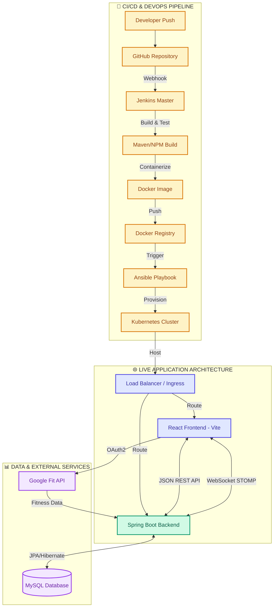
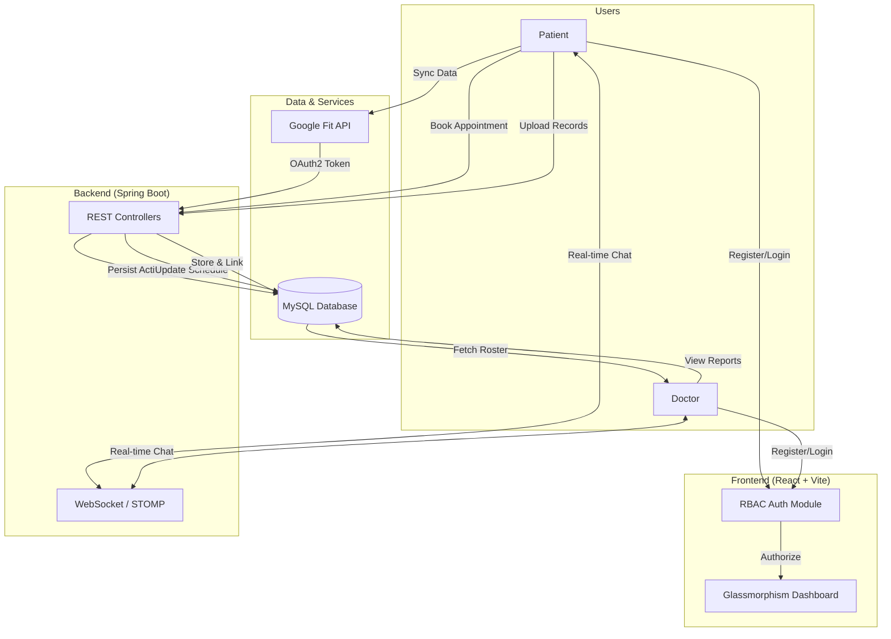
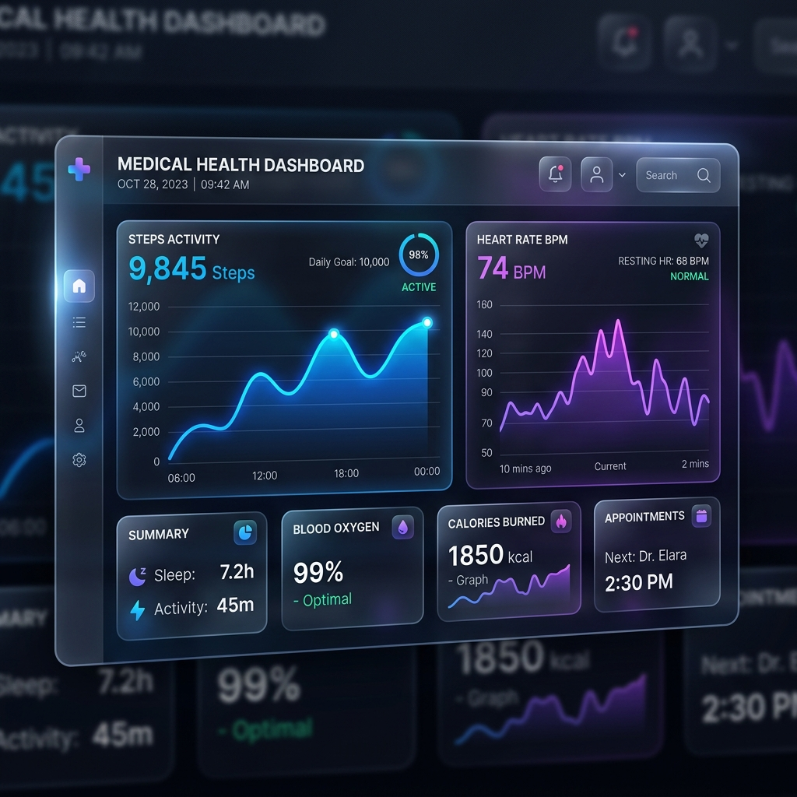
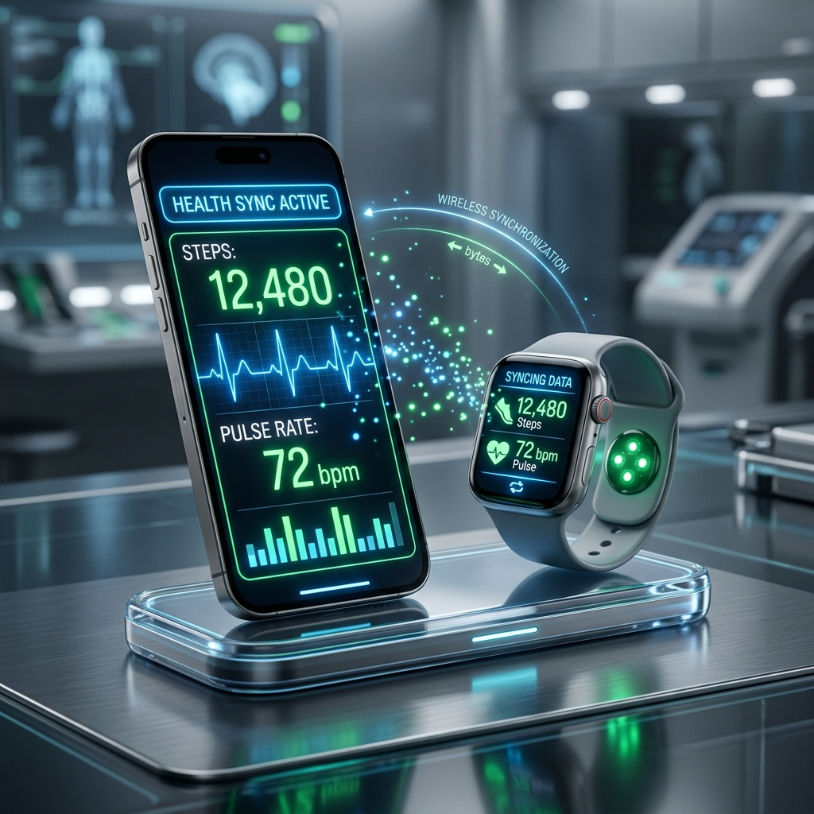

# 🏥 HealthCare Plus - Next Generation Health Management System

HealthCare Plus is a premium, full-stack health management platform designed with a modern **Glassmorphism UI** and enterprise-grade infrastructure. It bridges the gap between patients and doctors through real-time communication, automated health tracking, and secure record management.


## 🎯 Project Philosophy & Problem Statement

### The Problem .
Traditional healthcare systems often suffer from:
- **Fragmented Data**: Patient records, activity logs, and doctor communications are scattered across different platforms.
- **Manual Tracking**: Patients struggle to manually log daily health metrics like steps and exercise, leading to inconsistent data.
- **Communication Barriers**: High latency in doctor-patient communication often delays critical medical advice.
- **Outdated UI/UX**: Legacy systems are difficult to navigate, discouraging regular patient engagement.

### The Solution
HealthCare Plus solves these issues by providing a **unified ecosystem**:
- **Automated Data Ingestion**: Seamlessly syncs with wearable devices (Google Fit) to eliminate manual entry error.
- **Instant Connectivity**: Uses WebSocket-based TCP communication for zero-latency doctor-patient consultation.
- **Centralized Management**: Combines medical records, activity tracking, and appointment scheduling into a single, high-performance portal.
- **Modern Design**: Leverages premium Glassmorphism aesthetics to provide an engaging, intuitive user experience.

---

## 🗺 Master Project Ecosystem (Full Overview)



> **The Full Lifecycle**: Every code improvement flows through an automated pipeline (Yellow). The React SPA (Blue) communicates with the Spring Boot engine (Green) via REST and WebSockets. Data is stored in MySQL (Purple), and health metrics are synced via Google Fit (Red).

---

## 🔄 System Workflow



The application follows a secure, linear workflow designed for maximum efficiency:

1.  **Identity Management**: Users register as either a **Patient** or a **Doctor**. Role-Based Access Control (RBAC) ensures data security.
2.  **Health Ingestion**: Patients sync their smartwatches via the **Google Fit API**. Data (steps, exercise, hydration) is automatically persisted to the MySQL database.
3.  **Appointment Lifecycle**: Patients view a list of real-time available doctors, book appointments, and provide clinical notes.
4.  **Clinical Review**: Doctors access their **Patient Roster**, viewing live health improvement graphs and medical histories derived from the patient's activity.
5.  **Real-time Consultation**: Both parties communicate via a secure, persistent **WebSocket (STOMP)** connection for instant medical advice.
6.  **Record Archival**: Patients upload lab reports (PDF/Images) which are securely stored and instantly accessible by their assigned doctor.

---

## ✨ Key Features

### 🚀 Modern Engineering
- **Glassmorphism UI**: A stunning, responsive interface built with React and Vanilla CSS for a premium feel.
- **Real-time Consultation**: Low-latency chat powered by **WebSockets (STOMP/SockJS)** over TCP for instant doctor-patient communication.
- **Wearable Integration**: Direct sync with **Google Fit API** to automatically track steps, exercise hours, and hydration.
- **Interactive Analytics**: Dynamic health improvement graphs using **Recharts**.

### 🛠 Enterprise CI/CD Pipeline

```mermaid
graph LR
    Dev[Developer] -->|Git Push| GH[GitHub Repository]
    GH -->|Webhook| J[Jenkins Server]
    
    subgraph "CI Pipeline"
        J -->|Build| M[Maven/NPM Build]
        M -->|Test| UT[Unit/Integration Tests]
        UT -->|Containerize| D[Docker Build]
        D -->|Push| DR[Docker Registry]
    end
    
    subgraph "CD Pipeline"
        DR -->|Trigger| A[Ansible Playbook]
        A -->|Configure| K[Kubernetes Cluster]
        K -->|Deploy| POD[Live Application Pods]
    end
```



The infrastructure is powered by an industry-standard DevOps toolchain:

- **Jenkins (The Orchestrator)**: Acts as the "brain" of the operation. It automatically detects code changes on GitHub via a webhook (exposed using **ngrok** to bridge the local server), triggers the build process, runs tests, and coordinates between Docker, Ansible, and Kubernetes.
- **Docker (The Packaging)**: Ensures "it works on my machine" everywhere. Every part of the application (Frontend & Backend) is packaged into a lightweight, portable container that includes all its dependencies.
- **Kubernetes (The Manager)**: Handles the production environment. If a part of the app crashes, K8s automatically restarts it. It also handles scaling and ensures the application is always highly available to patients and doctors.
- **Ansible (The Automation)**: Automates the setup of our infrastructure. Instead of manually configuring servers, Ansible playbooks are used to deploy Kubernetes resources and configure the production environment in a predictable, repeatable way.

### ☸️ Kubernetes Deployment Deep Dive

The deployment to Kubernetes is fully automated via the Jenkins pipeline (`Jenkinsfile`) and defined in the `k8s/` directory. Here is how it functions:

1. **Containerization:** The Vite frontend and Spring Boot backend are built into distinct Docker images and pushed to Docker Hub during the CI phase.
2. **Dynamic Manifest Injection:** Jenkins dynamically injects the new Docker image tags (using the Jenkins build ID) into the Kubernetes deployment manifests (`backend-deployment.yaml` and `frontend-deployment.yaml`).
3. **Automated Rollouts:** Jenkins applies the updated manifests directly to the Kubernetes cluster using `kubectl`. Kubernetes recognizes the new image tags and executes a **Rolling Update**, ensuring zero-downtime deployments.
4. **Advanced Infrastructure:**
    - **Scalability:** A Horizontal Pod Autoscaler (`hpa.yaml`) automatically spins up additional pods during high traffic and scales down when idle.
    - **Self-Healing & Observability:** The cluster utilizes an **ELK Stack** (`elk-stack.yaml`) for centralized logging and **HashiCorp Vault** (`vault.yaml`) for secure secret injection. Crashed pods are automatically restarted by the Kubernetes control plane.

---

## 🛠 Tech Stack & Component Focus

| Component | Technology | Rationale & Focus |
| :--- | :--- | :--- |
| **Frontend** | React, Vite | Focused on **State Management** and **HMR** for a highly responsive user experience. |
| **Styling** | Vanilla CSS | Custom design system using **Glassmorphism** and HSL color tokens for visual excellence. |
| **Backend** | Spring Boot | Handles **Business Logic**, Security, and high-concurrency API requests. |
| **Persistence** | MySQL, JPA | Ensures **Data ACIDity** and complex relational mapping for medical records. |
| **Real-time** | STOMP over TCP | Provides a **Stateful Connection** for sub-second messaging latency. |
| **Integrations** | Google OAuth2 | Secure, standard-compliant **OAuth2.0 flow** for fitness data authorization. |
| **Infrastructure** | K8s, Docker | Ensures the system is **Highly Available** and can scale based on traffic. |

---

## 🏗 Deep Dive: Frontend & Backend Architecture

The application is built on a **Decoupled Architecture**, where the frontend and backend operate independently but are tightly integrated through standardized communication protocols.

### 🎨 Frontend (The Experience Layer)
**Built with:** `React.js`, `Vite`, `Lucide React`, `Recharts`

The frontend is a **Single Page Application (SPA)** that focuses on providing a high-performance, immersive user experience.
- **Glassmorphism Design**: Custom-built CSS system utilizing backdrop filters, HSL color tokens, and transparency for a premium feel.
- **State Management**: Uses React Hooks (`useState`, `useEffect`) to maintain real-time UI consistency.
- **Client-Side Routing**: Handled by `React Router`, providing seamless transitions between the Patient and Doctor portals.
- **External Integration**: Implements the **Google OAuth2** flow for secure wearable data ingestion.
- **Real-time Engine**: Integrated with `@stomp/stompjs` to maintain a persistent connection to the messaging server.

### ⚙️ Backend (The Logic Layer)
**Built with:** `Spring Boot`, `Spring Security`, `Spring Data JPA`, `MySQL`

The backend serves as the **Single Source of Truth** for the entire system.
- **RESTful API**: Provides a secure set of endpoints for appointment booking, health record management, and activity tracking.
- **Data Persistence**: Uses **Hibernate/JPA** for robust Object-Relational Mapping (ORM), ensuring medical data is stored safely in MySQL.
- **Real-time Messaging**: Implements a **STOMP Message Broker** that routes messages between users based on their unique IDs.
- **Security & RBAC**: Implements Role-Based Access Control to ensure doctors cannot access patient activity logs without authorization and vice versa.
- **CORS Management**: Configured to securely handle requests from the Vite development server and production Kubernetes ingresses.

### 🔗 The Connection: How They Work Together
The frontend and backend communicate through two primary channels:
1.  **JSON REST API**: For standard operations (like logging in or booking an appointment), the frontend sends an `HTTP POST/GET` request with a JSON payload. The backend processes the logic and returns a structured JSON response.
2.  **WebSocket (TCP) Bridge**: For real-time features like the chat, the frontend opens a stateful **SockJS** connection. This allows the backend to "push" messages to the frontend instantly without the user needing to refresh the page.

---

## 📸 Screen Gallery

| Patient Dashboard & Analytics | Wearable Sync & IoT |
| :---: | :---: |
|  |  |

> [!NOTE]
> The UI uses a custom-built design system with HSL colors and dynamic backdrops.

---

## 🚀 Getting Started

### 1. Prerequisites
- Node.js (v18+)
- Java 17+
- MySQL Server
- Docker & Kubernetes (optional for local dev)

### 2. Backend Setup
```bash
cd backend
./mvnw spring-boot:run
```
*Backend runs on `http://localhost:8081`*

### 3. Frontend Setup
```bash
cd frontend
npm install
npm run dev
```
*Frontend runs on `http://localhost:5173`*

### 4. Google Fit Integration
To enable live syncing:
1. Get your Client ID from [Google Cloud Console](https://console.cloud.google.com/).
2. Update `GOOGLE_CLIENT_ID` in `frontend/src/App.jsx`.

---

## 🗺 Future Roadmap

We are constantly evolving HealthCare Plus to include cutting-edge features:

- [ ] **AI Health Assistant**: Integrated LLM for preliminary symptom checking and health advice based on wearable data.
- [ ] **Pharmacy Integration**: Direct prescription sending to local pharmacies and automated medicine delivery tracking.
- [ ] **Video Consultations**: Moving beyond text chat to secure, high-definition video conferencing for clinical sessions.
- [ ] **Global Data Standards**: Implementing HL7 FHIR standards for seamless interoperability with hospital systems worldwide.
- [ ] **Mobile Application**: Native iOS and Android apps built with React Native for better on-the-go tracking.

---

## 📄 License
Distributed under the MIT License. See `LICENSE` for more information.

Developed with ❤️ by [Rohit Bansal](https://github.com/Rohitbansaldeveloper)
